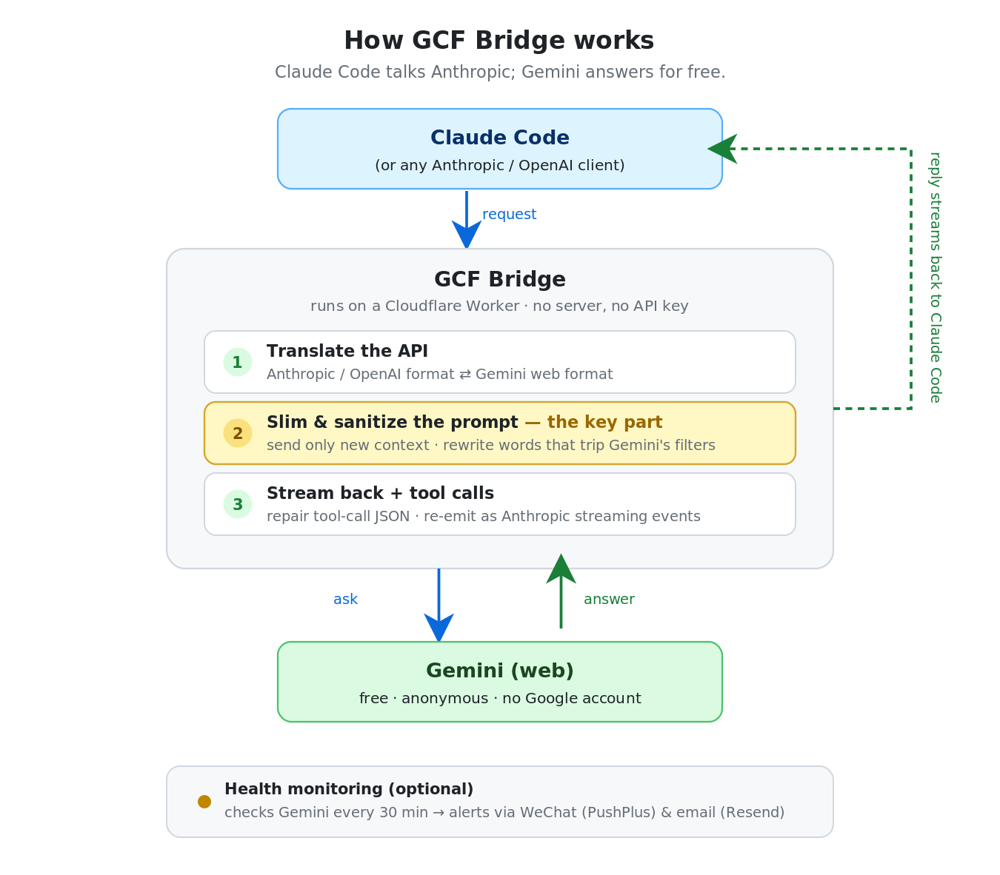
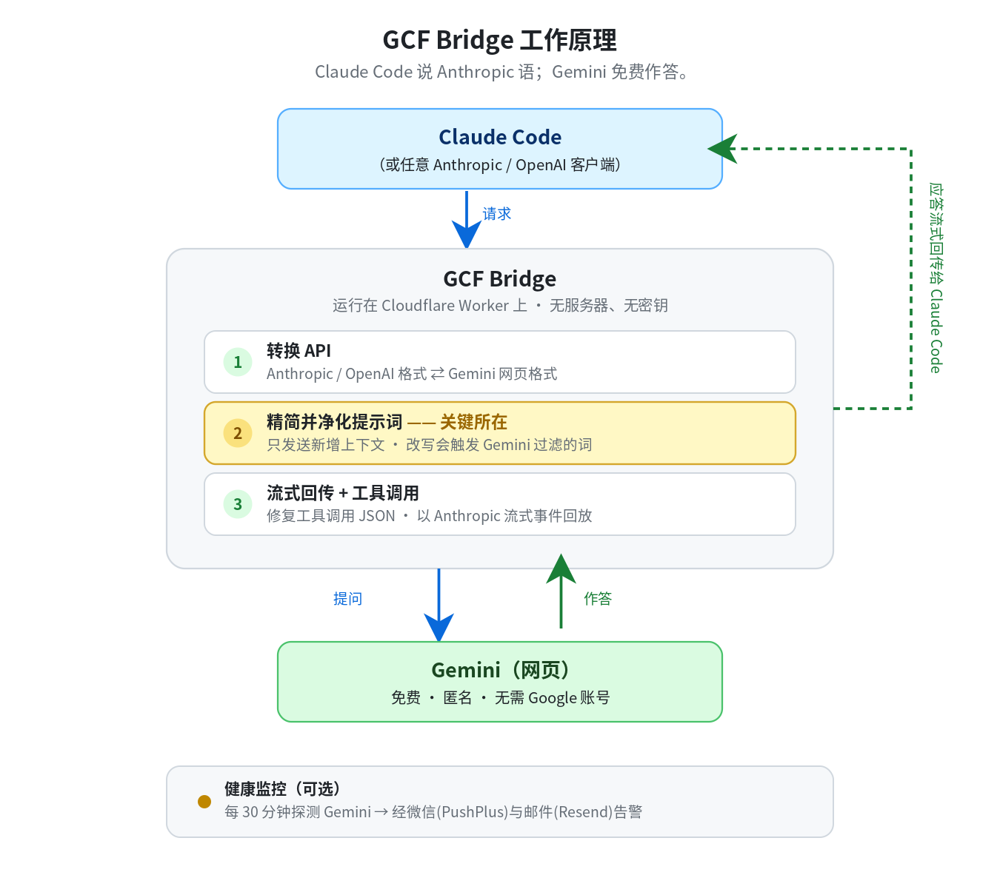
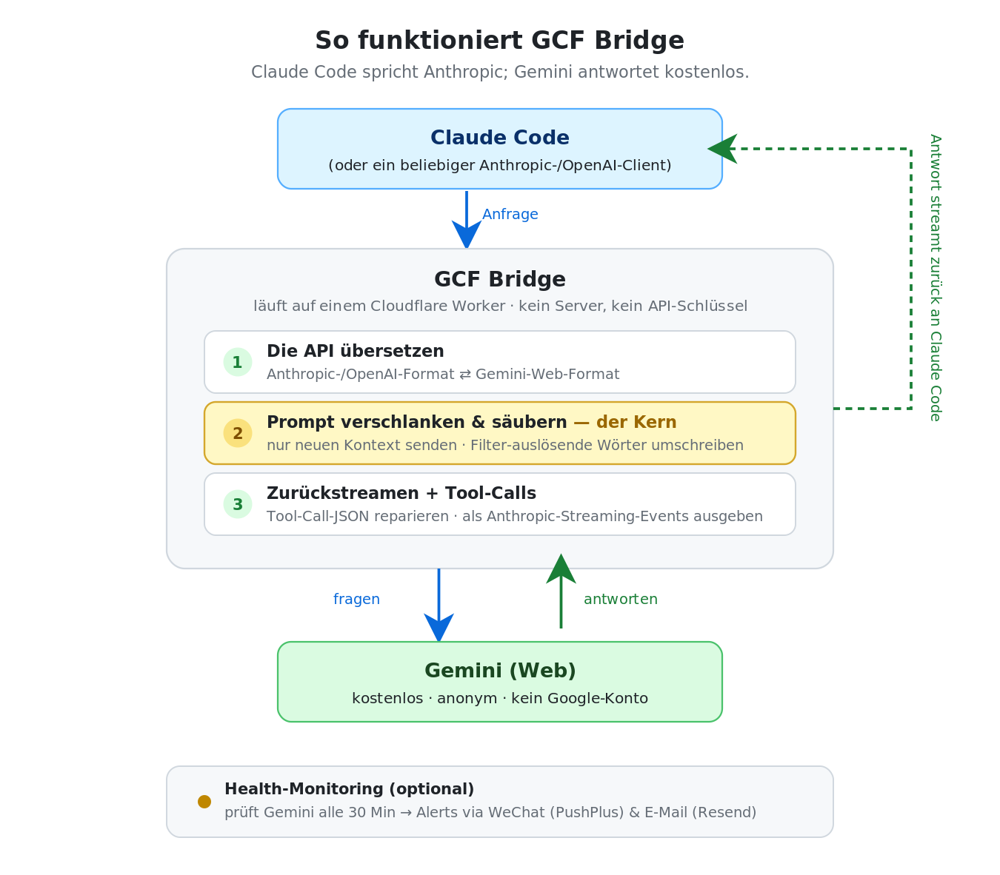

<div align="center">

# GCF Bridge

### Run Claude Code on free Gemini.

**An Anthropic- & OpenAI-compatible API for Google Gemini's web interface — deployed on Cloudflare Workers, no API key, no server.**

[](LICENSE)
[]()
[]()

**🌐 [English](#english) · [中文](#中文) · [Deutsch](#deutsch)**

</div>

---

## <a id="english"></a>🇬🇧 English

<div align="center">
  
</div>

### What is this?

GCF Bridge turns **Google Gemini's free web interface** into a drop-in **Anthropic API** (`/v1/messages`) and **OpenAI API** (`/v1/chat/completions`). Point [Claude Code](https://docs.anthropic.com/en/docs/claude-code) — or any Anthropic/OpenAI client — at your Worker, and it runs on Gemini.

- **No Anthropic key.** No Google account either — Gemini is called in anonymous guest mode.
- **No server.** Runs entirely on Cloudflare Workers' global edge.
- **No browser automation.** Pure HTTP against the reverse-engineered `BardFrontendService` — no Playwright, no headless Chrome.

The hard part isn't proxying requests — it's making Claude Code's massive, safety-sensitive prompts actually survive Gemini's consumer-web filters. That's what GCF Bridge is really for.

### Features

**Compatibility**
- `POST /v1/messages` — Anthropic Messages API (the Claude Code endpoint)
- `POST /v1/chat/completions` — OpenAI Chat Completions API
- `GET /v1/models` — spoofed Anthropic model catalog (passes client boot validation)
- `POST /v1/messages/count_tokens` · `GET /health`
- SSE **streaming** and Anthropic-format **tool calling**

**The secret sauce — surviving Gemini's safety filters**
- **Delta Slicing** — Claude Code resends its entire growing context every turn. The bridge keeps the last sent blocks in KV (per API key) and forwards **only the new delta**, cutting tokens and dodging safety triggers.
- **`sanitizePrompt`** — dynamically rewrites prompt fragments that silently trip Gemini's consumer filters: networking/proxy terms, bare XML tags like `<system-reminder>`, prompt-injection / OWASP phrasing, and geo-sensitive words — without losing instruction meaning.
- **Retry de-dup cache** — caches the last real response in KV so client timeout-retries never get a blank `Standing by.` placeholder.

**Quality & reliability**
- **BL auto-update & self-healing** — dynamically fetches the latest Gemini frontend build label from `gemini.google.com` on HTTP 405 errors and refreshes KV cache proactively during 30-min health checks, eliminating downtime when Google rotates versions.
- **Claude Persona (Disabled)** — Previously prepended a condensed Claude Fable 5 persona. Disabled because Gemini's safety filter now blocks model impersonation prompts ("Sorry, I cannot pretend to be someone else.").
- **Health monitoring** — a Cron Trigger probes Gemini every 30 min and alerts via **PushPlus (WeChat)** + **Resend (email)** on outage/recovery, with state in KV and a `GET /health` endpoint.

### Quick start
```bash
git clone https://github.com/shijiuzhang/GCF-bridge.git
cd GCF-bridge
npm install

# create the KV namespace, then paste the returned id into wrangler.toml
wrangler kv:namespace create SESSION_KV

npm run deploy        # deploy to Cloudflare Workers
# or: npm run worker  # local dev via wrangler
# or: node server.js  # plain Node server on :8787 (no Cloudflare needed)
```

Optional — enable health alerts:

```bash
wrangler secret put PUSHPLUS_TOKEN   # from pushplus.plus (WeChat push)
wrangler secret put RESEND_API_KEY   # from resend.com (email)
wrangler secret put NOTIFY_EMAIL     # where alerts are sent
```

### Using with Claude Code
```bash
export ANTHROPIC_BASE_URL="https://your-worker.workers.dev/v1"
export ANTHROPIC_API_KEY="any"
claude
```

For a persistent setup (and running behind a local proxy/firewall), configure `~/.claude/settings.json` — see the [Claude Code setup guide](docs/claude-code-setup.md). Key points: map all `ANTHROPIC_*_MODEL` entries to `claude-3-5-sonnet-20241022` (the Worker remaps them to Gemini), and set `HTTP_PROXY`/`HTTPS_PROXY` since Node.js ignores macOS system proxies.

### Models

| Model | Description |
|-------|-------------|
| `gemini-3.8-flash` | Latest all-around model (default) |
| `gemini-3.8-flash-thinking` | Deep thinking (~20k chars) |
| `gemini-3.7-flash` | All-around model |
| `gemini-3.6-flash` | Fast, general-purpose |
| `gemini-3.5-flash` | Legacy general-purpose |
| `gemini-3.5-flash-thinking` | Deep thinking (~20k chars) |
| `gemini-3.5-flash-thinking-lite` | Dynamic / adaptive thinking |
| `gemini-3.1-pro` | Pro (falls back to Flash when anonymous) |
| `gemini-flash-lite` | Lightweight & fast |
| `gemini-auto` | Automatic selection |

Append `@think=N` to any model to set thinking depth (`0` = deepest, `4` = shallowest), e.g. `gemini-3.8-flash@think=2`.

### How it compares

| | **GCF Bridge** | Chimera | GeminiBridge |
|---|:---:|:---:|:---:|
| Runtime | Cloudflare Workers | Local Python | Local Python |
| Auth | Anonymous guest | Cookie required | Optional |
| Browser dependency | None (pure HTTP) | Playwright | nodriver |
| Anthropic endpoint | ✅ | ✅ | ✅ |
| OpenAI endpoint | ✅ | — | — |
| Delta slicing | ✅ | ✅ | ❌ |
| Tool calling | ✅ | ✅ | partial |

### Disclaimer

This project interacts with Google Gemini's web endpoints through reverse engineering and is intended for **personal, educational, and research use**. It is not affiliated with Google or Anthropic. Review and comply with the relevant providers' Terms of Service before use; you are responsible for how you use it.

Version history: [CHANGELOG.md](CHANGELOG.md) · License: [MIT](LICENSE)

---

## <a id="中文"></a>🇨🇳 中文

<div align="center">
  
</div>

### 这是什么？

GCF Bridge 把 **Google Gemini 的免费网页端**封装成开箱即用的 **Anthropic API**（`/v1/messages`）和 **OpenAI API**（`/v1/chat/completions`）。把 [Claude Code](https://docs.anthropic.com/en/docs/claude-code) —— 或任何 Anthropic/OpenAI 客户端 —— 指向你的 Worker，它就跑在 Gemini 上。

- **零 Anthropic 密钥**：也不需要 Google 账号 —— 以匿名访客模式调用 Gemini。
- **零服务器**：完全运行在 Cloudflare Workers 的全球边缘节点。
- **零浏览器自动化**：纯 HTTP 直连逆向的 `BardFrontendService` —— 无需 Playwright、无需无头浏览器。

真正难的不是转发请求，而是让 Claude Code 庞大且涉及安全词的提示词**真正绕过 Gemini 消费级网页端的安全过滤**。这才是 GCF Bridge 的核心价值。

### 特性

**兼容性**
- `POST /v1/messages` —— Anthropic Messages API（Claude Code 使用的端点）
- `POST /v1/chat/completions` —— OpenAI Chat Completions API
- `GET /v1/models` —— 伪造的 Anthropic 模型列表（通过客户端启动校验）
- `POST /v1/messages/count_tokens` · `GET /health`
- SSE **流式输出** 与 Anthropic 格式的 **工具调用**

**核心绝活 —— 绕过 Gemini 安全过滤**
- **Delta Slicing（增量裁剪）** —— Claude Code 每轮都重发不断增长的完整上下文。本桥把上次发送的内容块存入 KV（按 API key 隔离），**只转发新增的增量**，既省 token 又规避安全触发。
- **`sanitizePrompt`** —— 动态改写会悄悄触发 Gemini 消费级过滤的提示词片段：网络/代理词、`<system-reminder>` 等裸 XML 标签、提示词注入/OWASP 措辞、地域敏感词 —— 且不损失指令语义。
- **工具调用修复** —— 用大括号计数提取 `<TOOL_CALL>` 块、修复残缺 JSON，并以标准 Anthropic SSE 事件（`tool_use` / `input_json_delta` / `content_block_stop`）回放，使 Claude Code 能正常调用本地工具。
- **重试去重缓存** —— 把上一次真实应答缓存在 KV 中，让客户端超时重试不再收到空白的 `Standing by.` 占位响应。

**质量与可靠性**
- **BL 自动更新与自愈机制** —— 遭遇 HTTP 405 时自动从 `gemini.google.com` 抓取最新构建标识（BL）并自动重试，并在 30 分钟 Cron 探活任务中主动刷新 KV 缓存，彻底解决谷歌前端版本轮换导致的连接中断。
- **Claude 人格（已禁用）** —— 此前注入精炼版 Claude Fable 5 人格，现因 Gemini 风控升级禁止模型伪装（回复“抱歉我不能伪装成其他人”）而已默认禁用。
- **健康监控** —— Cron Trigger 每 30 分钟探测 Gemini，状态变化（宕机/恢复）时通过 **PushPlus（微信）** 与 **Resend（邮件）** 告警；状态存于 KV，并提供 `GET /health` 端点。

### 快速开始

```bash
git clone https://github.com/shijiuzhang/GCF-bridge.git
cd GCF-bridge
npm install

# 创建 KV namespace，把返回的 id 填入 wrangler.toml
wrangler kv:namespace create SESSION_KV

npm run deploy        # 部署到 Cloudflare Workers
# 或: npm run worker  # 通过 wrangler 本地开发
# 或: node server.js  # 纯 Node 服务，端口 8787（无需 Cloudflare）
```

可选 —— 启用健康告警：

```bash
wrangler secret put PUSHPLUS_TOKEN   # 来自 pushplus.plus（微信推送）
wrangler secret put RESEND_API_KEY   # 来自 resend.com（邮件）
wrangler secret put NOTIFY_EMAIL     # 接收告警的邮箱
```

### 配合 Claude Code 使用

```bash
export ANTHROPIC_BASE_URL="https://your-worker.workers.dev/v1"
export ANTHROPIC_API_KEY="any"
claude
```

如需持久化配置（以及在本地代理/防火墙后运行），请配置 `~/.claude/settings.json` —— 见 [Claude Code 配置指南](docs/claude-code-setup.md)。要点：把所有 `ANTHROPIC_*_MODEL` 设为 `claude-3-5-sonnet-20241022`（Worker 会自动映射到 Gemini），并设置 `HTTP_PROXY`/`HTTPS_PROXY`，因为 Node.js 不读取 macOS 系统代理。

### 可用模型

| 模型 | 说明 |
|-------|------|
| `gemini-3.8-flash` | 最新全能模型（默认） |
| `gemini-3.8-flash-thinking` | 深度思考（约 20k 字符） |
| `gemini-3.7-flash` | 全能模型 |
| `gemini-3.6-flash` | 快速通用模型 |
| `gemini-3.5-flash` | 早期通用模型 |
| `gemini-3.5-flash-thinking` | 深度思考（约 20k 字符） |
| `gemini-3.5-flash-thinking-lite` | 动态/自适应思考 |
| `gemini-3.1-pro` | Pro（匿名时降级为 Flash） |
| `gemini-flash-lite` | 轻量快速 |
| `gemini-auto` | 自动选择 |

在任意模型名后追加 `@think=N` 可调整思考深度（`0` = 最深，`4` = 最浅），例如 `gemini-3.8-flash@think=2`。

### 同类对比

| | **GCF Bridge** | Chimera | GeminiBridge |
|---|:---:|:---:|:---:|
| 运行环境 | Cloudflare Workers | 本地 Python | 本地 Python |
| 认证 | 匿名访客 | 需要 Cookie | 可选 |
| 浏览器依赖 | 无（纯 HTTP） | Playwright | nodriver |
| Anthropic 端点 | ✅ | ✅ | ✅ |
| OpenAI 端点 | ✅ | — | — |
| 增量裁剪 | ✅ | ✅ | ❌ |
| 工具调用 | ✅ | ✅ | 部分 |

### 免责声明

本项目通过逆向工程与 Google Gemini 网页端交互，仅用于**个人、教育与研究用途**。本项目与 Google 或 Anthropic 无任何关联。使用前请阅读并遵守相关服务方的服务条款；你需对自己的使用方式负责。

版本历史：[CHANGELOG.md](CHANGELOG.md) · 许可证：[MIT](LICENSE)

---

## <a id="deutsch"></a>🇩🇪 Deutsch

<div align="center">
  
</div>

### Was ist das?

GCF Bridge verwandelt **die kostenlose Web-Oberfläche von Google Gemini** in eine sofort einsetzbare **Anthropic-API** (`/v1/messages`) und **OpenAI-API** (`/v1/chat/completions`). Richte [Claude Code](https://docs.anthropic.com/en/docs/claude-code) — oder einen beliebigen Anthropic-/OpenAI-Client — auf deinen Worker, und er läuft auf Gemini.

- **Kein Anthropic-Schlüssel.** Auch kein Google-Konto — Gemini wird im anonymen Gastmodus aufgerufen.
- **Kein Server.** Läuft vollständig auf dem globalen Edge-Netzwerk von Cloudflare Workers.
- **Keine Browser-Automatisierung.** Reines HTTP gegen den reverse-engineerten `BardFrontendService` — kein Playwright, kein Headless-Chrome.

Das Schwierige ist nicht das Weiterleiten von Anfragen, sondern die riesigen, sicherheitssensiblen Prompts von Claude Code tatsächlich durch Geminis Consumer-Web-Filter zu bringen. Genau dafür ist GCF Bridge gemacht.

### Funktionen

**Kompatibilität**
- `POST /v1/messages` — Anthropic Messages API (der Claude-Code-Endpunkt)
- `POST /v1/chat/completions` — OpenAI Chat Completions API
- `GET /v1/models` — vorgetäuschter Anthropic-Modellkatalog (besteht die Client-Startvalidierung)
- `POST /v1/messages/count_tokens` · `GET /health`
- SSE-**Streaming** und **Tool-Calling** im Anthropic-Format

**Das Geheimrezept — Geminis Sicherheitsfilter überstehen**
- **Delta Slicing** — Claude Code sendet jede Runde den gesamten, wachsenden Kontext erneut. Die Bridge speichert die zuletzt gesendeten Blöcke in KV (pro API-Schlüssel) und leitet **nur das neue Delta** weiter — das spart Token und vermeidet Sicherheitsauslöser.
- **`sanitizePrompt`** — schreibt dynamisch Prompt-Fragmente um, die Geminis Consumer-Filter stillschweigend auslösen: Netzwerk-/Proxy-Begriffe, nackte XML-Tags wie `<system-reminder>`, Prompt-Injection-/OWASP-Formulierungen und geo-sensible Wörter — ohne die Bedeutung der Anweisungen zu verlieren.
- **Tool-Call-Reparatur** — extrahiert `<TOOL_CALL>`-Blöcke per Klammerzählung, repariert fehlerhaftes JSON und sendet standardkonforme Anthropic-SSE-Ereignisse (`tool_use` / `input_json_delta` / `content_block_stop`), damit Claude Code lokale Tools aufrufen kann.
- **Retry-Deduplizierungs-Cache** — speichert die letzte echte Antwort in KV, sodass Timeout-Wiederholungen des Clients nie einen leeren `Standing by.`-Platzhalter erhalten.

**Qualität & Zuverlässigkeit**
- **BL Auto-Update & Self-Healing** — Ruft bei HTTP-405-Fehlern automatisch das neueste Gemini-Frontend-Build-Label von `gemini.google.com` ab und aktualisiert den KV-Cache im 30-minütigen Health-Check, um Ausfälle bei Google-Frontend-Updates zu verhindern.
- **Claude-Persona (Deaktiviert)** — Zuvor wurde eine Claude-Persona vorangestellt. Deaktiviert, da Geminis Sicherheitsfilter Modellanmaßung blockiert.
- **Health-Monitoring** — ein Cron-Trigger prüft Gemini alle 30 Minuten und alarmiert bei Ausfall/Wiederherstellung über **PushPlus (WeChat)** + **Resend (E-Mail)**; der Zustand liegt in KV, plus ein `GET /health`-Endpunkt.

### Schnellstart

```bash
git clone https://github.com/shijiuzhang/GCF-bridge.git
cd GCF-bridge
npm install

# KV-Namespace anlegen, dann die zurückgegebene id in wrangler.toml eintragen
wrangler kv:namespace create SESSION_KV

npm run deploy        # auf Cloudflare Workers deployen
# oder: npm run worker  # lokale Entwicklung via wrangler
# oder: node server.js  # einfacher Node-Server auf :8787 (kein Cloudflare nötig)
```

Optional — Health-Alerts aktivieren:

```bash
wrangler secret put PUSHPLUS_TOKEN   # von pushplus.plus (WeChat-Push)
wrangler secret put RESEND_API_KEY   # von resend.com (E-Mail)
wrangler secret put NOTIFY_EMAIL     # Zieladresse für Alerts
```

### Verwendung mit Claude Code

```bash
export ANTHROPIC_BASE_URL="https://your-worker.workers.dev/v1"
export ANTHROPIC_API_KEY="any"
claude
```

Für eine dauerhafte Einrichtung (und den Betrieb hinter einem lokalen Proxy/einer Firewall) konfiguriere `~/.claude/settings.json` — siehe die [Claude-Code-Einrichtungsanleitung](docs/claude-code-setup.md). Wichtig: Setze alle `ANTHROPIC_*_MODEL`-Einträge auf `claude-3-5-sonnet-20241022` (der Worker remappt sie auf Gemini) und setze `HTTP_PROXY`/`HTTPS_PROXY`, da Node.js die macOS-Systemproxies ignoriert.

### Modelle

| Modell | Beschreibung |
|-------|-------------|
| `gemini-3.8-flash` | Neuestes Allround-Modell (Standard) |
| `gemini-3.8-flash-thinking` | Tiefes Nachdenken (~20k Zeichen) |
| `gemini-3.7-flash` | Allround-Modell |
| `gemini-3.6-flash` | Schnell, universell |
| `gemini-3.5-flash` | Älteres Allround-Modell |
| `gemini-3.5-flash-thinking` | Tiefes Nachdenken (~20k Zeichen) |
| `gemini-3.5-flash-thinking-lite` | Dynamisches/adaptives Nachdenken |
| `gemini-3.1-pro` | Pro (fällt anonym auf Flash zurück) |
| `gemini-flash-lite` | Leichtgewichtig & schnell |
| `gemini-auto` | Automatische Auswahl |

Hänge `@think=N` an ein beliebiges Modell an, um die Denktiefe festzulegen (`0` = am tiefsten, `4` = am flachsten), z. B. `gemini-3.8-flash@think=2`.

### Vergleich

| | **GCF Bridge** | Chimera | GeminiBridge |
|---|:---:|:---:|:---:|
| Laufzeit | Cloudflare Workers | Lokales Python | Lokales Python |
| Auth | Anonymer Gast | Cookie erforderlich | Optional |
| Browser-Abhängigkeit | Keine (reines HTTP) | Playwright | nodriver |
| Anthropic-Endpunkt | ✅ | ✅ | ✅ |
| OpenAI-Endpunkt | ✅ | — | — |
| Delta Slicing | ✅ | ✅ | ❌ |
| Tool-Calling | ✅ | ✅ | teilweise |

### Haftungsausschluss

Dieses Projekt interagiert per Reverse Engineering mit den Web-Endpunkten von Google Gemini und ist für die **private, schulische und wissenschaftliche Nutzung** gedacht. Es steht in keiner Verbindung zu Google oder Anthropic. Lies und befolge vor der Nutzung die Nutzungsbedingungen der jeweiligen Anbieter; für die Art deiner Nutzung bist du selbst verantwortlich.

Versionsverlauf: [CHANGELOG.md](CHANGELOG.md) · Lizenz: [MIT](LICENSE)
